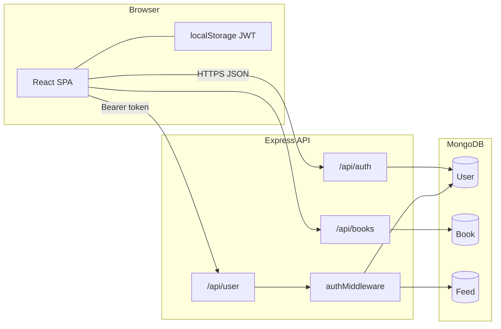

# ReadersUniverse — Technical guide & interview Q&A

This document explains how the project is put together from an engineering perspective and doubles as an **interview preparation guide**: typical questions, concise answers, and pointers to what you might improve in a real production system.

---

## 1. System architecture

### 1.1 High-level diagram



### 1.2 Separation of concerns

- **Presentation & routing** live in `ru_frontend` (React components under `src/pages`, shared UI under `src/components`).
- **Business rules and persistence** live in `ru_backend` (Express routers, Mongoose models, middleware).
- **Cross-cutting API access** on the client is partially centralized in `ru_frontend/src/services/api.js` (Axios instance + JWT interceptor). Some screens still call `axios` directly with full URLs—useful to mention in interviews as a consistency/refactor topic.

---

## 2. Backend technical reference

### 2.1 Entry point and middleware

`ru_backend/server.js`:

- Loads environment variables with `dotenv`.
- Connects to MongoDB via `config/db.js`.
- Applies `cors()` and `express.json()`.
- Mounts routers: `/api/auth`, `/api/user`, `/api/books`.

### 2.2 Database connection

`ru_backend/config/db.js` uses `mongoose.connect(process.env.MONGO_URI)` and exits the process on failure. That fail-fast behavior is appropriate for a small API so misconfiguration is obvious at startup.

### 2.3 Authentication

**Registration** (`POST /api/auth/register`):

- Validates required fields including non-empty `genres`.
- Checks uniqueness for `email` and `username`.
- Hashes the password with **bcrypt** (`bcrypt.hash`, cost factor `10`).
- Persists a `User` document.

**Login** (`POST /api/auth/login`):

- Finds user by email, compares password with `bcrypt.compare`.
- Issues a **JWT** with payload `{ userId }` and `expiresIn: "1h"`.
- Returns token plus a safe subset of user fields (no password).

**Profile** (`GET /api/auth/profile`):

- Protected by `authMiddleware`; returns the user without the password field.

**JWT middleware** (`ru_backend/middleware/authMiddleware.js`):

- Expects `Authorization: Bearer <token>`.
- Verifies token with the same secret used at sign-in (`JWT_SECRET` or dev fallback).

### 2.4 Data models (Mongoose)

**User** (`ru_backend/models/User.js`):

- Identity: `fullname`, `username`, `email`, `password`.
- Preferences: `genres` (string array).
- Embedded subdocuments:
  - `wishlist[]`: `{ title, author, cover }`
  - `currentlyReading[]`: `{ title, author, cover, progress }`
- `timestamps: true` adds `createdAt` / `updatedAt`.

**Book** (`ru_backend/models/Book.js`):

- Standalone collection with `user` as `ObjectId` ref to `User`, plus `title`, `author`, `genre`, optional `year`, `coverUrl`, `description`, timestamps.

**Feed** (`ru_backend/models/Feed.js`):

- `user` ref, `content` string, timestamps.

### 2.5 User-scoped routes (`/api/user`)

All of the following use `authMiddleware` and `req.user.userId` from the JWT.

| Method | Path | Purpose |
|--------|------|---------|
| POST | `/wishlist` | Add book (deduped by title + author) |
| GET | `/wishlist` | List wishlist |
| DELETE | `/wishlist` | Remove by title + author |
| POST | `/current-reading` | Start a book (progress defaults to 0) |
| GET | `/current-reading` | List in-progress books |
| PATCH | `/current-reading` | Update `progress` for a title + author |
| DELETE | `/current-reading` | Remove entry |
| GET | `/matches` | Reader discovery (see §3) |
| POST | `/feed` | Create post |
| GET | `/feed` | List posts, newest first, populate author username |
| DELETE | `/feed/:id` | Delete if owner matches JWT user |

### 2.6 Book catalog routes (`/api/books`)

- `POST /` creates a book; **requires `user`, `title`, `author`, `genre`** in the body.
- `GET /` returns all books sorted by `createdAt` descending.

**Interview-relevant note:** These routes are **not** wrapped in `authMiddleware` in `server.js`. Any client can POST or GET. In production you would typically require auth, validate that `user` matches the authenticated id (or drop `user` from the body and infer it server-side), and rate-limit writes.

---

## 3. Matching algorithm (how “Book Mates” work)

Implementation: `GET /api/user/matches` in `ru_backend/routes/user.js`.

1. Load the current user (`me`) including `genres` and `wishlist`.
2. Query other users where `_id` is not `me._id` and **either**:
   - Any of their `genres` appears in `me.genres` (`$in`), **or**
   - Any of their wishlist book titles appears in `me.wishlist` titles (`wishlist.title` `$in` mapped titles).
3. Project `fullname`, `username`, `genres`, `wishlist`, `profilePic` (note: `profilePic` is not defined on the base User schema in code—Mongoose may still store it if present in DB documents).
4. Map each match to a UI-friendly object: `id`, `name`, `genres`, `favBook` (first overlapping wishlist title, else first wishlist title, else empty string), `avatar` (or a default image URL).

**Strengths:** Simple, fast for modest user counts, easy to explain.

**Limitations:** No ranking/score, no pagination, title-only overlap (no ISBN), and OR logic can surface weak matches if one dimension overlaps by accident.

---

## 4. Frontend technical reference

### 4.1 Routing

`ru_frontend/src/App.jsx` defines routes such as `/`, `/signup`, `/login`, `/dashboard`, `/profile`, `/favourites`, `/matches`, `/feed`, `/current-reading`, `/add-book`, `/settings`, `/about`.

### 4.2 API client

`ru_frontend/src/services/api.js`:

- `baseURL: "http://localhost:5000/api"`.
- Request interceptor attaches `Authorization: Bearer <token>` from `localStorage`.

Pages such as **Login**, **Signup**, and **Feed** use this instance. Others (e.g. **Matches**, **Dashboard**, **AddBook**) may use raw `axios` with explicit URLs—same origin assumptions but duplicated configuration.

### 4.3 Auth state in the browser

- On successful login, the client stores `token` and `userId` in `localStorage`.
- **AddBook** sends `user: userId` in the JSON body to `/api/books`.

### 4.4 UI stack

- **Tailwind** utility classes for layout and styling.
- **React Toastify** for success/error toasts (also a global `ToastContainer` in `App.jsx`).
- **React Icons** for iconography on some screens.

---

## 5. Security & operations checklist (honest assessment)

Use this section in interviews to show you understand trade-offs, not only happy paths.

| Topic | Current behavior | Production-oriented improvement |
|--------|------------------|----------------------------------|
| JWT storage | `localStorage` | Prefer `httpOnly` secure cookies + CSRF strategy, or hardened SPA patterns |
| Secret | Fallback string if env missing | Fail startup without `JWT_SECRET`; rotate secrets |
| CORS | `cors()` default | Restrict origins to your frontend domain(s) |
| `/api/books` | Open read/write | Authenticate; bind `user` to token; validate ObjectId |
| Password policy | Minimal | Length/complexity, breach checks, account lockout where appropriate |
| HTTPS | Dev HTTP | TLS everywhere; HSTS at edge |

---

## 6. Interview Q&A

### Architecture & design

**Q: Why split `Book` as its own collection while wishlist items are embedded in `User`?**  
**A:** `Book` documents model a catalog-style entry (genre, year, description) tied to a submitting user and are easy to query globally (`GET /api/books`). Wishlist entries are lightweight snapshots (title, author, cover) optimized for fast reads/writes on the user profile without joins. Trade-off: the same logical book can exist in multiple shapes (embedded vs collection) unless you later normalize with references or external IDs.

**Q: Why use JWT instead of sessions?**  
**A:** JWTs are stateless: the API can verify signatures without server-side session storage, which scales simply for a class project or small API. The trade-off is revocation and refresh-token flows—you would add a token blacklist, short expiry + refresh tokens, or server sessions for stricter control.

**Q: Where would you add caching?**  
**A:** For `GET /api/books` and possibly `GET /api/user/feed` if traffic grows—using HTTP cache headers, a CDN for static assets, or Redis for hot keys. Matches could be cached per user with TTL if the query becomes heavy.

### Backend / Node / Express

**Q: What does `authMiddleware` do step by step?**  
**A:** Read `Authorization` header, ensure it starts with `Bearer `, extract the token, `jwt.verify` with the shared secret, attach `decoded` (including `userId`) to `req.user`, call `next()`, or return 401/403 on missing/invalid tokens.

**Q: Why bcrypt “salt rounds” of 10?**  
**A:** It controls work factor: higher is slower for attackers but also for your server. 10 is a common default for web apps; you might tune based on security policy and latency budgets.

**Q: How would you paginate `GET /api/books`?**  
**A:** Accept `limit` and `cursor` or `page` query params, use `.limit()` and `.skip()` or cursor-based `_id` filtering, and return `nextCursor` metadata. Always cap `limit` to prevent abuse.

### MongoDB / Mongoose

**Q: Explain the matches query in MongoDB terms.**  
**A:** It filters `User` with `_id: { $ne: me._id }` and `$or` of two clauses: `{ genres: { $in: me.genres } }` for genre overlap, and `{ "wishlist.title": { $in: [...titles from me.wishlist] } }` for title overlap. Empty arrays in `$in` behave carefully—if `me.wishlist` is empty, that clause still runs but matches no titles until titles exist.

**Q: When would you prefer embedding vs referencing?**  
**A:** Embed when data is owned by one document, read together, and bounded in size (wishlist items). Reference when entities are shared, large, or need independent querying (here, `Book` references `User`).

### Frontend / React

**Q: How does the Axios interceptor help?**  
**A:** It centralizes attaching the JWT so each request does not manually set headers—reducing bugs when endpoints grow.

**Q: How would you protect routes on the client?**  
**A:** Today routes are mostly open in the router; you’d add a wrapper component or loader that checks `localStorage` token (or better, validates with `/api/auth/profile`) and redirects unauthenticated users to `/login`. Also handle expired JWTs (401) globally with an interceptor redirect.

**Q: Why might `userId` in localStorage be null after login?**  
**A:** The login response returns `user.id` (not `_id`). The client saves `res.data.user?._id || res.data.user?.id`—the fallback handles that shape mismatch. In interviews, stress aligning API contracts and TypeScript types to avoid silent nulls.

### APIs & HTTP

**Q: Difference between 401 and 403 in this codebase?**  
**A:** Example: wrong password yields **401** “Invalid credentials”; missing Bearer token yields **401** from middleware; invalid/expired token yields **403** in middleware; deleting someone else’s feed post yields **403** “Not authorized.” Teams sometimes standardize differently—consistency matters.

**Q: Why is `PATCH /api/user/current-reading` used for progress?**  
**A:** Partial update of one field (`progress`) without replacing the whole subdocument array; RESTfully signals a partial resource update.

### DevOps & quality

**Q: How would you deploy this?**  
**A:** Backend: Node on a VM/container (Fly.io, Render, AWS ECS), `MONGO_URI` and `JWT_SECRET` from a secret manager, health check on `/`. Frontend: static build to S3/CloudFront or Vercel/Netlify; configure API `baseURL` via environment at build time (`import.meta.env` in Vite).

**Q: What tests would you add first?**  
**A:** Integration tests for auth (register/login), wishlist deduplication, feed authorization on delete, and matches query with fixture users. Contract tests between frontend and API if the team is larger.

### Behavioral / project ownership

**Q: What was the hardest part of ReadersUniverse?**  
**A:** *(Personalize.)* Example angles: aligning embedded wishlist data with the match query, deciding between embedded vs `Book` collection, or unifying Axios usage and environment-based API URLs.

**Q: What would you do next with two more weeks?**  
**A:** Secure `/api/books`, refresh tokens, route guards, pagination, user avatars persisted on `User`, search, and basic moderation for the feed.

---

## 7. Quick API cheat sheet (for interview whiteboards)

```
POST   /api/auth/register          → 201 + userId
POST   /api/auth/login             → 200 + token + user
GET    /api/auth/profile           → 200 + user (Bearer)

POST   /api/user/wishlist          → body: title, author, cover
GET    /api/user/wishlist
DELETE /api/user/wishlist          → body: title, author

POST   /api/user/current-reading   → body: title, author, cover
GET    /api/user/current-reading
PATCH  /api/user/current-reading   → body: title, author, progress
DELETE /api/user/current-reading   → body: title, author

GET    /api/user/matches

POST   /api/user/feed              → body: content
GET    /api/user/feed
DELETE /api/user/feed/:id

POST   /api/books                  → body: user, title, author, genre, ...
GET    /api/books
```

---

## 8. Glossary

| Term | Meaning here |
|------|----------------|
| JWT | Signed token carrying `userId` for stateless auth |
| Mongoose | ODM mapping JS objects to MongoDB documents |
| Embedded document | Sub-object stored inside a parent document (wishlist items) |
| Populate | Mongoose replacing an ObjectId ref with fields from the referenced document (`Feed` → `user`) |

---

*End of technical guide. Update this file when routes, models, or deployment assumptions change.*